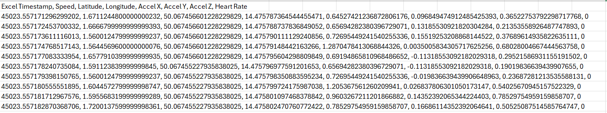
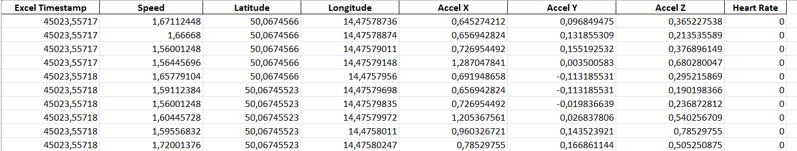
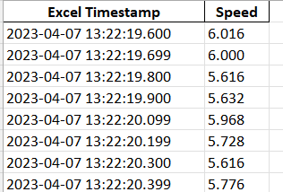
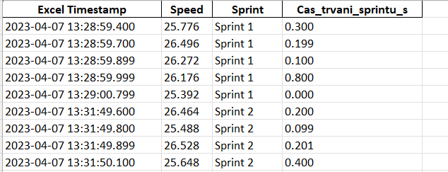
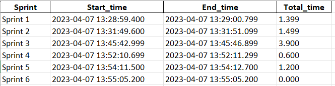
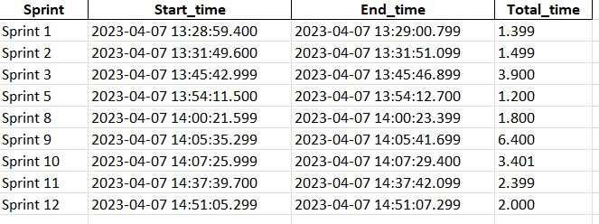

# GPS-Data-Converter

Tento nástroj převádí GPS data hráčů z neformátovaných CSV souborů do přehledně strukturovaného Excel (XLSX) souboru. Program je navržen speciálně pro analýzu pohybových dat fotbalových hráčů se zaměřením na rychlostní ukazatele

## Obsah
- [Požadavky](#požadavky)
- [Instalace](#instalace)
- [Použití](#použití)
- [Struktura vstupních dat](#struktura-vstupních-dat)
- [Struktura výstupních dat](#struktura-výstupních-dat)
- [Příklad použití](#příklad-použití)
- [Řešení problémů](#řešení-problémů)
- [O projektu](#o-projektu)

## Požadavky

Pro spuštění tohoto nástroje potřebujete:
- Python 3.8 nebo novější
- Následující Python knihovny:
  - pandas
  - openpyxl

## Instalace

1. **Stáhněte si tento repozitář** do své složky nebo naklonujte pomocí git:
   ```
   git clone https://github.com/vaseuzivatelskejmeno/gps-data-converter.git
   ```

2. **Vytvořte virtuální prostředí** (doporučeno, ale nepovinné):
   ```
   python -m venv venv
   ```

3. **Aktivujte virtuální prostředí**:
   - Ve Windows:
     ```
     venv\Scripts\activate
     ```
   - V Linuxu/macOS:
     ```
     source venv/bin/activate
     ```

4. **Nainstalujte požadované knihovny**:
   ```
   pip install pandas openpyxl
   ```

## Použití

### Základní použití

1. **Otevřete příkazový řádek** (cmd.exe ve Windows):
   - Stiskněte klávesu Windows + R
   - Napište `cmd` a stiskněte Enter

2. **Přejděte do složky s programem**:
   ```
   cd cesta\k\vaší\složce\gps-data-converter
   ```

3. **Umístěte svůj CSV soubor** do stejné složky jako script `main.py`

4. **Spusťte program** s cestou k vašemu vstupnímu CSV souboru:
   ```
   python main.py nazev_vstupniho_souboru.csv
   ```
   
   Program automaticky vytvoří výstupní XLSX soubor ve stejné složce.

### Pokročilé použití

- **Zadání vlastního názvu výstupního souboru**:
  ```
  python main.py nazev_vstupniho_souboru.csv -o output_file.xlsx
  ```

- **Použití souborů z jiných složek**:
  ```
  python main.py cesta\k\vstupnimu\souboru.csv -o cesta\k\vystupnimu\souboru.xlsx
  ```

## Struktura vstupních dat


| Veličina v CSV   | Snímač / zdroj                          | Jednotka                                                | Proč je relevantní pro uživatele tohoto nástroje        |
|------------------|-----------------------------------------|---------------------------------------------------------|---------------------------------------------------------|
| Excel Timestamp  | interní časová známka (OpenField)       | dny od 30.12.1899 → převádí se na YYYY-MM-DD HH:MM:SS.SSS | převod na lidsky čitelný čas a identifikace vzorků    |
| Latitude         | GPS/GNSS (10 Hz)                        | °                                                       | zpětné mapování pozice hráče; zachovává se v pův. datech |
| Longitude        | GPS/GNSS (10 Hz)                        | °                                                       | totéž jako Latitude                                     |
| Speed            | filtrovaná rychlost z OpenFieldu        | m/s (v CSV) → km/h                                      | klíčová veličina pro detekci sprintů (≥ 25,2 km/h)      |
| Accel X          | 3osý akcelerometr (100 Hz, export 10 Hz) | g (±16 g)                                               | hrubý ukazatel dynamiky v podélné ose                   |
| Accel Y          | 3osý akcelerometr                       | g                                                       | dynamika v laterální (boční) ose                        |
| Accel Z          | 3osý akcelerometr                       | g                                                       | vertikální akcelerace (výskoky, dopady)                 |
| Heart Rate       | vestavěné EKG / Polar H1/H10            | bpm                                                     | sledování kardio‑zátěže společně s pohybem             |

### Vstupni data

CSV soubor exportovaný z platformy OpenField musí minimálně obsahovat specifikované datové sloupce, přičemž každý řádek reprezentuje jeden jednotlivý vzorek měření. Vzhledem k tomu, že akviziční frekvence je nastavena na 10 Hz (tj. 10 vzorků za sekundu), lze očekávat, že dvouhodinový kontinuální záznam bude obsahovat přibližně 72 000 řádků datových záznamů. Tento rozsah odpovídá standardním požadavkům na vysokofrekvenční longitudinální sběr dat v aplikacích sledování sportovního výkonu




## Struktura výstupních dat

Výstupní Excel soubor obsahuje několik listů, každý s jinými informacemi:

### 1. List "Puvodni data"
- Tento list obsahuje  původní data bez úprav přesně tak, jak byla v CSV souboru. Kompletní zaznamenané  datové body bez vynechání. Každý řádek reprezentuje jeden vzorek získaný při vzorkovací frekvenci 10 Hz



### 2. List "Cas a Rychlost"
- Tento list obsahuje kompletní záznam všech naměřených datových bodů v oblasti filtrované na základě atributů datum, čas a rychlost, bez jakékoli agregace nebo vynechání. Filtrování bylo provedeno výhradně na úrovni výběru relevantních sloupců (datum, čas a rychlost), přičemž samotná měřená data zůstala v plném rozsahu zachována

Sloupce:
- **Excel Timestamp**: Převedeno do formátu čitelného pro člověka (YYYY-MM-DD HH:MM:SS.SSS)
- **Speed**: Rychlost převedená z m/s na km/h, zaokrouhlená na 3 desetinná místa



### 3. List "≥ 25,2_kmh"
- Tento list obsahuje všechna data filtrovaná na základě základního kritéria překročení rychlosti ≥ 25,2 km/h

Sloupce:
- **Excel Timestamp**: Čas ve formátu YYYY-MM-DD HH:MM:SS.SSS
- **Speed**: Rychlost v km/h, zaokrouhlená na 3 desetinná místa
- **Sprint**: Sloupec Sprint identifikuje příslušnost jednotlivých vzorků k samostatným sprintovým úsekům. Sprint je považován za samostatný, pokud mezi dvěma úseky s rychlostí nad prahovou hodnotou existuje časová mezera. To znamená, že pokud sportovec dosáhne rychlosti ≥ 25,2 km/h, a po uplynutí určité doby opět překročí tuto rychlost, vznikají sekvenčně nové sprintové události (Sprint 1, Sprint 2 atd.)
- **Cas_trvani_sprintu_s**: Sloupec Cas_trvani_sprintu_s udává délku trvání příslušného sprintového intervalu vztaženou ke každému jednotlivému řádku. Časové značky ve sloupci Excel Timestamp zachovávají plnou kontinuitu měřených údajů s milisekundovým rozlišením



### 4. List "Pocet sprintu"
- Tento list shrnuje sprintové úseky identifikované na základě předchozí filtrace rychlostních dat s prahovou hodnotou ≥ 25,2 km/h. Na rozdíl od předchozího listu, kde každý řádek odpovídal jednomu jednotlivému vzorku, jsou zde data agregována tak, aby každý sprint tvořil ucelený časový úsek

Sloupce:
- **Sprint**: Označení sekvenčního pořadí jednotlivých sprintových úseků na základě jejich identifikace v měřeném záznamu
- **Start_time**: Čas začátku sprintu (YYYY-MM-DD HH:MM:SS.SSS)
- **End_time**: Čas konce sprintu (YYYY-MM-DD HH:MM:SS.SSS)
- **Total_time**: Celkové trvání sprintu v sekundách



### 5. List "≥1s"
- Tento list obsahuje sprintové úseky, jejichž celková doba trvání byla ≥ 1,0 sekundy. Datová struktura je shodná s listem sumarizujícím všechny sprinty, avšak zde jsou zahrnuty pouze ty sprinty, které splnily minimální časové kritérium. Výběr sprintů byl proveden dodatečnou filtrací sprintových úseků na základě trvání, přičemž sprinty kratší než 1 sekunda byly vyloučeny. Tím je zajištěna relevance dat pro analýzy, které se zaměřují na významnější sprintové výkony


Sloupce:
- **Sprint**: Pořadové číslo identifikovaného sprintu
- **Start_time**: Čas začátku sprintu
- **End_time**: Čas konce sprintu
- **Total_time**: Celkové trvání sprintu v sekundách




## Řešení problémů

### Chyba: "Vstupní soubor nebyl nalezen"
- Ujistěte se, že jste zadali správnou cestu k souboru
- Zkontrolujte, zda soubor existuje a není otevřený v jiném programu
- Pokud používáte relativní cestu, ujistěte se, že jste v příkazovém řádku ve správné složce

### Chyba: "Některé potřebné sloupce chybí"
- Ujistěte se, že váš CSV soubor obsahuje sloupce "Excel Timestamp" a "Speed"
- Zkontrolujte název sloupců, zda neobsahují přebytečné mezery

### Program nereaguje nebo běží dlouho
- U velkých souborů může zpracování trvat déle
- Zkontrolujte, zda má váš počítač dostatek volné paměti RAM


## O projektu

### Tento projekt byl vyvinut s cílem podpořit práci datových analytiků a trenérských týmů ve fotbalovém prostředí prostřednictvím automatizovaného zpracování syrových GPS dat hráčů. Primárním zadáním bylo převést neupravené CSV soubory obsahující nepřehledná a nestrukturovaná data do standardizovaného formátu vhodného pro efektivní analýzu a interpretaci. V rámci řešení byla implementována transformační pipeline, která data nejprve vyčistila, logicky strukturovala a následně aplikovala doménově specifická filtrační kritéria zaměřená na identifikaci sprintových aktivit hráčů. Výstupní výsledky byly organizovány do vícelistového Excel souboru, přičemž každý list systematicky dokumentuje jednotlivé fáze procesu: od raw dat, přes očištěné záznamy, až po agregované statistiky sprintových úseků. Tento přístup zajišťuje vysokou úroveň transparentnosti, zpětné dohledatelnosti a umožňuje analytikům a trenérům komplexní pohled na herní intenzitu a výkonnost hráčů.

---


### Technická Specifikace Použitého Zařízení a Softwaru pro GPS Data Converter

#### Měřicí systém a data
##### Měřicí zařízení – Catapult Vector S7

Zařízení Catapult Vector S7 (Catapult Sports, Melbourne, Austrálie) je nositelný modul pro sportovní měření, schopný zaznamenávat polohu pomocí globálního družicového systému (GNSS) i lokálních systémů a snímat pohybové a fyziologické údaje 

Klíčové technické parametry zahrnují:

     - Rozměry a hmotnost - 81 × 43 × 16 mm, 53 g​
     - GNSS přijímač - 10Hz multi-GNSS (GPS + GLONASS) s podporou SBAS (Satellite-Based Augmentation  System) pro korekci
     - Možnost zvýšené frekvence až 18 Hz při využití pouze GPS​
     - Typická horizontální přesnost polohy je přibližně 1 m za optimálních podmínek GNSS​
     - Integrace systému Catapult ClearSky (ultra-širokopásmové UWB vysílání ~4 GHz) indoor (záznam při 100 Hz)​ 
     - Přesnost lokalizace v LPS dosahuje řádu desítek centimetrů (~0,1 m)​
     - Tříosý akcelerometr (rozsah ±16 g, interní vzorkování 1000 Hz, výstup 100 Hz)​
     - Tříosý gyroskop (rozsah ±2000 °/výstup 100 Hz)
     - Tříosý magnetometr (rozsah ±4900 μT, výstup 100 Hz)​
     - Vestavěný modul pro měření EKG (využívá připojené textilní vesty)
     - Podpora externích hrudních pásů (např. Polar H1/H10)​
     - UWB a Bluetooth 5 pro přenos dat a synchronizaci​ - dosah UWB signálu až 300 m v otevřeném prostoru​
     - Vestavěná baterie s výdrží ~6 hodin nepřetržitého provozu​

##### Softwarová platforma – Catapult OpenField

Pro konfiguraci zařízení, sběr a primární zpracování dat byl použit software Catapult OpenField (Catapult Sports, Melbourne, Austrálie), což je konzolová (desktopová) i cloudová analytická platforma pro monitorování sportovců​ OpenField umožňuje vizualizaci naměřených veličin v reálném čase, zpětnou analýzu tréninků a slouží k exportu dat pro další zpracování. Data z Vector S7 byla po skončení každé měřicí sekvence synchronizována s aplikací OpenField a exportována ve formátu CSV. Software podporuje export dat ve dvou úrovních rozlišení:

- 10Hz senzorový export: Standardní výstup obsahující data GNSS a odvozené metriky vzorkované na 10 Hz​

      - Časové razítko (relativní čas od začátku záznamu, ms)​
      - Zeměpisná šířka a délka (°) udávající polohu
      - Okamžitá rychlost pohybu (filtrovaná, m·s^−1)​
      - Akumulovaná vzdálenost (odometr, m)​
      - Okamžité zrychlení (m·s^−2) odvozené jako časová derivace rychlosti​
      - Srdeční frekvence (tepů za minutu)​
      - Index zatížení PlayerLoad (bezrozměrná veličina odvozená z akcelerometru)​
      - Ukazatele kvality GNSS signálu – počet satelitů, HDOP (horizontální diluce  přesnosti)
      - Interní metrika “Positional Quality” (%)​


- 100Hz vysokofrekvenční export: Volitelný detailní výstup obsahující surová data z inerciálních senzorů s plnou frekvencí 100 Hz. Tento režim poskytuje detailní informace o pohybu (např. jednotlivé osy akcelerometrů a gyroskopů), avšak pro potřeby projektu byl primárním zdrojem dat výše uvedený 10Hz export GNSS dat


Exportovaná data z OpenField (CSV soubory) sloužila jako vstupní podklad pro další zpracování v rámci projektu GPS Data Converter. Tato kombinace měřicího zařízení a softwaru zajišťuje, že veškeré analyzované údaje vycházejí z validovaného měřicího systému s definovanými technickými parametry a známou strukturou dat, což umožňuje transparentní převod a následnou analýzu těchto dat v projektu


## Autor 
jirpo9